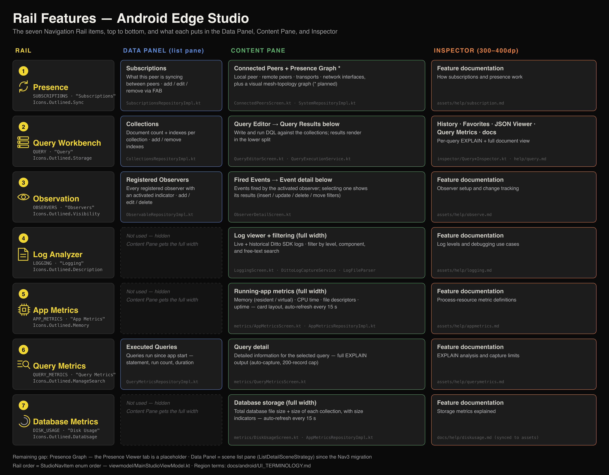

# Rail Features — Android Edge Studio

Canonical names and functions for the Navigation Rail items, top to bottom, and
what each one puts in the **Data Panel**, **Content Pane**, and **Inspector**
(region names defined in [`UI_TERMINOLOGY.md`](UI_TERMINOLOGY.md)).

*(Source: [`images/rail-features.svg`](images/rail-features.svg) — regenerate the PNG with `rsvg-convert -w 3840 --keep-aspect-ratio rail-features.svg -o rail-features.png`)*

---

## Quick Reference

The Rail is defined by `StudioNavItem` in
[`viewmodel/MainStudioViewModel.kt`](../../android/app/src/main/java/com/costoda/dittoedgestudio/viewmodel/MainStudioViewModel.kt)
(enum order = top-to-bottom rail order). Canonical names are the terms used in
docs, plans, and conversation; code names are what you'll grep for.

| # | Canonical Name | Code Enum | Code Label | Material Icon | Data Panel |
|---|---|---|---|---|---|
| 1 | **Presence** | `SUBSCRIPTIONS` | "Subscriptions" | `Icons.Outlined.Sync` | Yes |
| 2 | **Query Workbench** | `QUERY` | "Query" | `Icons.Outlined.Storage` | Yes |
| 3 | **Observation** | `OBSERVERS` | "Observers" | `Icons.Outlined.Visibility` | Yes |
| 4 | **Log Analyzer** | `LOGGING` | "Logging" | `Icons.Outlined.Description` | No — full-width Content Pane |
| 5 | **App Metrics** | `APP_METRICS` | "App Metrics" | `Icons.Outlined.Memory` | No — full-width Content Pane |
| 6 | **Query Metrics** | `QUERY_METRICS` | "Query Metrics" | `Icons.AutoMirrored.Outlined.ManageSearch` | Yes — executed-query list |
| 7 | **Database Metrics** | `DISK_USAGE` | "Disk Usage" | `Icons.Outlined.DataUsage` | No — full-width Content Pane |

Every rail item exposes feature documentation in the Inspector, rendered from a
Markdown file sourced from `docs/help/` (synced to `assets/help/` by
`scripts/sync-help-docs.sh`) via `StudioNavItem.helpFileName` →
`ui/mainstudio/inspector/HelpContentView.kt` (Markwon renderer).

> All code paths below are relative to
> `android/app/src/main/java/com/costoda/dittoedgestudio/` unless noted.

---

## 1. Presence

Everything about the mesh: what this peer is syncing and who it is connected to.

| Region | Contents |
|---|---|
| **Data Panel** | **Subscriptions** list — the DQL subscriptions registered on this peer, i.e. what data is being synced between peers. Add/edit/remove via FAB. |
| **Content Pane** | Two features: **Connected Peers** (local peer info, remote peers, transports, network interfaces) and the **Presence Graph** (visual mesh topology). |
| **Inspector** | Feature documentation. |

| Part | Code |
|---|---|
| Rail item | `StudioNavItem.SUBSCRIPTIONS` → `SubscriptionsKey` |
| List pane (Data Panel) | `ui/mainstudio/SubscriptionsListPane.kt`; section entry-point `ui/mainstudio/PresenceSection.kt` → `PresenceListSection` |
| Content pane (Connected Peers) | `ui/mainstudio/PresenceSection.kt` → `PresenceContentSection`; tabs: "Peers List" (`ConnectedPeersScreen.kt`) + "Presence Viewer" (placeholder); pushed on compact via `PresenceContentKey` |
| Presence Graph | **Not yet implemented** — Presence Viewer tab is a "Coming Soon" placeholder |
| Data layer | `data/repository/SubscriptionsRepositoryImpl.kt`, `data/repository/SystemRepositoryImpl.kt` (peers, sync status, transports) |
| Inspector docs | `assets/help/subscription.md` |

---

## 2. Query Workbench

The primary working surface: browse collections, write and run DQL, inspect results.

| Region | Contents |
|---|---|
| **Data Panel** | **Collections** list — each collection shows its document count and the indexes applied to it; the user can add and remove indexes from here. |
| **Content Pane** | **Query Editor** (write and run DQL against the collections) with **Query Results** shown below. |
| **Inspector** | **Query History**, **Favorite Queries**, **JSON Document Viewer**, **Query Metrics** (per-query EXPLAIN), and feature documentation. |

| Part | Code |
|---|---|
| Rail item | `StudioNavItem.QUERY` → `QueryKey` |
| List pane (Collections, Data Panel) | `ui/mainstudio/CollectionsListPane.kt`; section entry-point `ui/mainstudio/QueryWorkbenchSection.kt` → `QueryWorkbenchListSection`; data via `data/repository/CollectionsRepositoryImpl.kt` (doc counts, index add/remove) |
| Content pane (Query Editor + Results) | `ui/mainstudio/QueryWorkbenchSection.kt` → `QueryWorkbenchContentSection` hosting `QueryEditorScreen.kt`; Ctrl/Cmd+Enter runs query; state persists on session-scoped `QueryWorkbenchState`; pushed on compact via `QueryContentKey` |
| Execution | `data/repository/QueryExecutionService.kt`; state in `viewmodel/QueryEditorViewModel.kt` |
| Inspector | Rich `ui/mainstudio/inspector/QueryInspectorView.kt` (History / Favorites / JSON viewer / Metrics tabs); threaded via scaffold's `inspectorContent` slot |
| Inspector — History | `ui/mainstudio/inspector/QueryHistoryInspector.kt`, `data/repository/HistoryRepositoryImpl.kt` |
| Inspector — Favorites | `ui/mainstudio/inspector/QueryFavoritesInspector.kt`, `data/repository/FavoritesRepositoryImpl.kt` |
| Inspector — JSON viewer | `ui/mainstudio/inspector/QueryJsonInspector.kt` |
| Inspector — Query metrics | `ui/mainstudio/inspector/QueryMetricsInspector.kt`, `data/repository/QueryMetricsRepositoryImpl.kt` |
| Inspector docs | `assets/help/query.md` |

---

## 3. Observation

Live-query observers: register them, activate them, and watch the change events they fire.

| Region | Contents |
|---|---|
| **Data Panel** | **Observers** list — every observer that has been registered, with an indicator showing whether it is currently activated. Add/edit/delete from here. |
| **Content Pane** | **Events list** — the events fired by the selected (activated) observer; selecting an event shows its results/detail below. |
| **Inspector** | Feature documentation. |

| Part | Code |
|---|---|
| Rail item | `StudioNavItem.OBSERVERS` → `ObserversKey` |
| List pane (Observers, Data Panel) | `ui/mainstudio/ObserversListPane.kt`; section entry-point `ui/mainstudio/ObserversSection.kt` → `ObserversListSection`; CRUD + activation in `viewmodel/MainStudioViewModel.kt` |
| Content pane (Events list + detail) | `ui/mainstudio/ObserversSection.kt` → `ObserverEventsSection` hosting `ObserverDetailScreen.kt`; `ObserverEventsTable` (top) + `ObserverEventDetailView` (bottom, with insert/update/delete/move filters); pushed via `ObserverEventsKey` |
| Data layer | `data/repository/ObservableRepositoryImpl.kt`; models `DittoObservable`, `DittoObserveEvent` |
| Inspector docs | `assets/help/observe.md` |

---

## 4. Log Analyzer

Ditto SDK log capture. No Data Panel — the Content Pane takes the full width so
there is maximum room for log lines.

| Region | Contents |
|---|---|
| **Data Panel** | Not used (hidden). |
| **Content Pane** | Log viewer with filtering — by level, by component, and free-text search; live capture plus historical log files. |
| **Inspector** | Feature documentation. |

| Part | Code |
|---|---|
| Rail item | `StudioNavItem.LOGGING` → `LoggingKey` |
| Content pane (single-pane, full-width) | `ui/mainstudio/SinglePaneSections.kt` → `LoggingSection` → `LoggingScreen.kt` |
| Data layer | `DittoLogCaptureService` (live capture), `LogFileParser`; models `LogEntry`, `LogComponent` |
| Inspector docs | `assets/help/logging.md` |

---

## 5. App Metrics

Process-level health of the running app. No Data Panel — full-width Content Pane.

| Region | Contents |
|---|---|
| **Data Panel** | Not used (hidden). |
| **Content Pane** | Card-based metrics about the running app: memory (resident/virtual), CPU time, file descriptors, uptime. Auto-refreshes every 15 seconds. |
| **Inspector** | Feature documentation. |

| Part | Code |
|---|---|
| Rail item | `StudioNavItem.APP_METRICS` → `AppMetricsKey` |
| Content pane (single-pane, full-width) | `ui/mainstudio/SinglePaneSections.kt` → `AppMetricsSection` → `ui/mainstudio/metrics/AppMetricsScreen.kt` |
| State / refresh | `viewmodel/AppMetricsViewModel.kt` |
| Data layer | `data/repository/AppMetricsRepositoryImpl.kt` |
| Inspector docs | `assets/help/appmetrics.md` |

---

## 6. Query Metrics

EXPLAIN-level analysis of every query run since the app started.

| Region | Contents |
|---|---|
| **Data Panel** | List of queries executed since app start (statement, run count, duration). |
| **Content Pane** | Detailed information for the query selected in the Data Panel — full EXPLAIN output. |
| **Inspector** | Feature documentation. |

| Part | Code |
|---|---|
| Rail item | `StudioNavItem.QUERY_METRICS` → `QueryMetricsKey` |
| List pane (executed-query list, Data Panel) | `ui/mainstudio/metrics/QueryMetricsListPane.kt`; section entry-point `ui/mainstudio/QueryMetricsSection.kt` → `QueryMetricsListSection` |
| Content pane (EXPLAIN detail) | `ui/mainstudio/metrics/QueryMetricsDetailPane.kt`; section entry-point `ui/mainstudio/QueryMetricsSection.kt` → `QueryMetricsDetailSection`; pushed via `QueryMetricDetailKey` |
| Data layer | `data/repository/QueryMetricsRepositoryImpl.kt`; model `QueryMetrics` (auto-capture, 200-record cap) |
| Inspector docs | `assets/help/querymetrics.md` |

---

## 7. Database Metrics

What the Ditto database costs on disk. No Data Panel — full-width Content Pane.

| Region | Contents |
|---|---|
| **Data Panel** | Not used (hidden). |
| **Content Pane** | Storage metrics for the database: total database file size and the size of each collection, with size indicators. Auto-refreshes every 15 seconds. |
| **Inspector** | Feature documentation. |

| Part | Code |
|---|---|
| Rail item | `StudioNavItem.DISK_USAGE` → `DiskUsageKey` |
| Content pane (single-pane, full-width) | `ui/mainstudio/SinglePaneSections.kt` → `DiskUsageSection` → `ui/mainstudio/metrics/DiskUsageScreen.kt` |
| State / refresh | `viewmodel/DiskUsageViewModel.kt` |
| Data layer | `data/repository/AppMetricsRepositoryImpl.kt` (shared with App Metrics) |
| Inspector docs | `assets/help/diskusage.md` |

---

## Known Gaps (canonical spec vs. current code)

| Item | Gap |
|---|---|
| Presence | **Presence Graph** view not implemented — Presence Viewer tab is a "Coming Soon" placeholder alongside the Connected Peers tab. |
| Naming | Code enum/labels (`SUBSCRIPTIONS`/"Subscriptions", `DISK_USAGE`/"Disk Usage", "Logging", "Observers") predate the canonical names (Presence, Database Metrics, Log Analyzer, Observation). Use canonical names in docs and UI copy going forward; code identifiers may lag. |

---

*Region terminology (Rail, Data Panel, Content Pane, Inspector, Nav Drawer): [`UI_TERMINOLOGY.md`](UI_TERMINOLOGY.md)*
*Layout source of truth: `android/app/src/main/java/com/costoda/dittoedgestudio/ui/mainstudio/StudioScaffold.kt` + `android/app/src/main/java/com/costoda/dittoedgestudio/ui/navigation/AppNavGraph.kt`*
