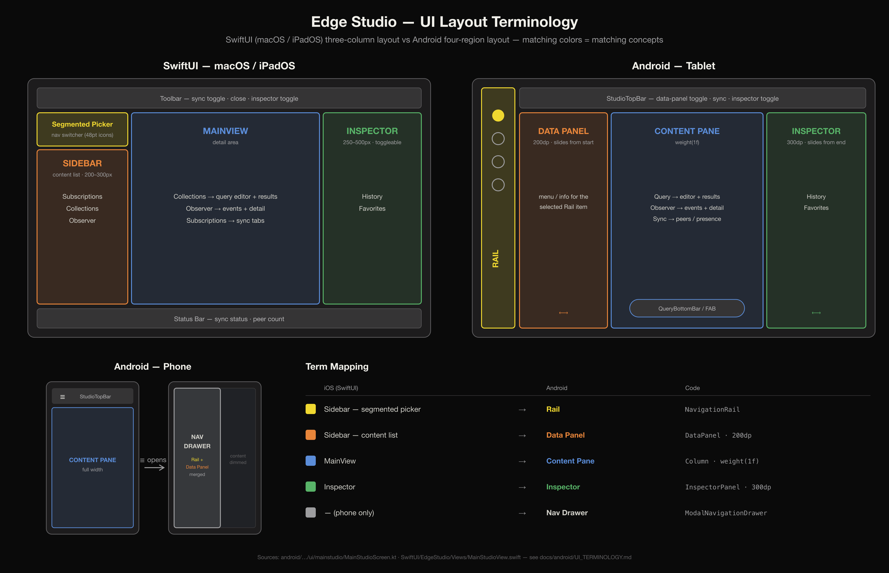

# UI Terminology Cheat Sheet — SwiftUI vs Android

Canonical names for the screen regions in both Edge Studio implementations.
When a plan, task, or conversation uses one of these terms, it refers to exactly
the region shown below.

For the Android Rail items themselves (Presence, Query Workbench, Observation,
Log Analyzer, App Metrics, Query Metrics, Database Metrics) and what each puts
in these regions, see [`RAIL_FEATURES.md`](RAIL_FEATURES.md).



*(Source: [`images/ui-terminology.svg`](images/ui-terminology.svg) — regenerate the PNG with `rsvg-convert -w 3840 --keep-aspect-ratio ui-terminology.svg -o ui-terminology.png`)*

---

## Side-by-Side Layout Comparison

### SwiftUI (macOS / iPadOS) — three-column layout

```
┌────────────────────────────────────────────────────────────────────────┐
│  Toolbar                  (sync toggle · close · inspector toggle)     │
├──────────────┬──────────────────────────────────────┬──────────────────┤
│              │                                      │                  │
│   SIDEBAR    │              MAINVIEW                │    INSPECTOR     │
│  200–300px   │           (detail area)              │    250–500px     │
│              │                                      │                  │
│  ┌────────┐  │   Collections → QueryEditor +        │  ┌────────────┐  │
│  │segmented│ │                 QueryResults         │  │ segmented  │  │
│  │ picker  │ │   Observer    → events + detail      │  │  picker    │  │
│  └────────┘  │   Subscriptions → sync tabs          │  └────────────┘  │
│              │                                      │                  │
│  Subscript.  │                                      │   History        │
│  Collections │                                      │   Favorites      │
│  Observer    │                                      │                  │
├──────────────┴──────────────────────────────────────┴──────────────────┤
│  Status Bar              (sync status · peer count)                    │
└────────────────────────────────────────────────────────────────────────┘
```

### Android (≥840dp) — scene-driven list-detail layout

```
┌────────────────────────────────────────────────────────────────────────┐
│       │  TopAppBar          (sync · close · inspector toggle)          │
│  ┌──┐ ├──────────────────┬──────────────────────────┬──────────────────┤
│  │▣ │ │                  │                          │                  │
│  │  │ │   DATA PANEL     │      CONTENT PANE        │    INSPECTOR     │
│  │◇ │ │  (list pane)     │     (detail pane)        │  300–400dp       │
│  │  │ │  scene-managed   │                          │  (default-       │
│  │○ │ │  width; capped   │  Query  → editor+results │   visible at     │
│  │  │ │  320dp at ≥1200  │  Obs.   → events+detail  │   ≥1200dp)       │
│  │⚙ │ │                  │  Pres.  → peers/tabs     │                  │
│  └──┘ │  feature menu /  │                          │  Query: History  │
│       │  list for the    │  ┌───────────────────┐   │  Favorites       │
│  RAIL │  selected item   │  │ QueryWorkbenchBar  │   │  JSON / Metrics  │
│       │  (default at     │  └───────────────────┘   │  Others: help    │
│       │   ≥840dp)        │                          │                  │
└───────┴──────────────────┴──────────────────────────┴──────────────────┘
```

### Android (600–839dp — Medium, e.g. open flip phone) — drawer chrome + two-pane body

At Medium widths the studio keeps the **drawer chrome** (hamburger, no rail column) but
the body still renders **Data Panel + Content Pane side-by-side** (the
`ListDetailSceneStrategy` gets two partitions via
`calculatePaneScaffoldDirectiveWithTwoPanesOnMediumWidth`). The drawer holds rail items
only. Exception: **Presence** with "Split Presence view" off (the default) keeps the
peers view full-width; its subscriptions list stays in the drawer.

### Android (<600dp — Compact phones, cover screens, narrow split-screen) — Nav Drawer + single pane

```
┌──────────────────────────┐      ┌──────────────────────────┐
│ ☰  TopAppBar             │      │▓▓▓▓▓▓▓▓▓▓▓│              │
├──────────────────────────┤      │▓ NAV     ▓│              │
│                          │  ☰ → │▓ DRAWER  ▓│  (content    │
│   CONTENT PANE           │      │▓         ▓│   dimmed)    │
│   (default view,         │      │▓  Rail +  ▓│              │
│    full width)           │      │▓  Data    ▓│              │
│                          │      │▓  Panel   ▓│              │
│  Query  → editor+results │      │▓  merged  ▓│              │
│  Pres.  → peers/tabs     │      │▓         ▓│              │
│  Obs.   → events+detail  │      │▓         ▓│              │
│  Metrics→ list first     │      │▓         ▓│              │
└──────────────────────────┘      └───────────┴──────────────┘
```

Below 600dp the studio runs in **single-pane drawer mode**:
- The TopAppBar shows a hamburger (left) and the inspector toggle (rightmost action,
  with sync + close between title and inspector toggle). On pushed drill-in detail
  screens (e.g. a Query Metrics record) the hamburger becomes an Up arrow.
- The modal drawer contains BOTH the rail items (section nav) AND the current section's
  Data Panel content (Subscriptions list / Collections list / Observers list). Rail
  items at top, divider, Data Panel below. Sections without a Data Panel (Logging /
  AppMetrics / Query Metrics / DiskUsage) show rail items only.
- The Content Pane is the DEFAULT view — peers tabs, query editor + results, observer
  events — except Query Metrics, which is list-first: the executed-query list is the
  body and tapping a row pushes the EXPLAIN detail as a drill-in (system back returns).
- Selecting anything in the drawer (a section OR a Data Panel item) closes the drawer.

---

## Term Mapping Table

| iOS (SwiftUI) | Android (Edge Studio) | Android code | Material Design term |
|---|---|---|---|
| Sidebar — segmented picker | **Rail** | `NavigationRail` in `StudioScaffold` (≥840dp) | Navigation Rail |
| Sidebar — content list | **Data Panel** | `ListDetailSceneStrategy.listPane` in `AppNavGraph` at ≥600dp; below 600dp lives inside the Nav Drawer below the rail items | List pane (list-detail layout) |
| MainView | **Content Pane** | `ListDetailSceneStrategy.detailPane` (or `detailPlaceholder`); side-by-side with the Data Panel at ≥600dp, full-width below 600dp | Detail pane / content pane |
| Inspector | **Inspector** | Inspector column in `StudioScaffold`; 300dp (<1200dp) / 360dp (≥1200dp) / 400dp (≥1600dp); `ModalBottomSheet` below 840dp | Side sheet / supporting pane |
| — (iPadOS uses sidebar) | **Nav Drawer** (<840dp only) | `ModalNavigationDrawer` in `StudioScaffold`: Rail items + Data Panel merged below 840dp | Modal navigation drawer |
| Toolbar | **Top Bar** | `TopAppBar` in `StudioScaffold` | Top app bar |
| Status Bar (bottom) | **Bottom Bar** | Floating `QueryWorkbenchBottomBar` (Query section only) | Bottom app bar |

---

## Behavior Differences Worth Remembering

| Behavior | iOS | Android |
|---|---|---|
| Data Panel visibility | Always visible | Visible side-by-side at ≥600dp (Medium+); below 600dp folded into the modal Nav Drawer (alongside rail items). Presence is configurable via Settings → "Split Presence view" |
| Inspector visibility | Toggle via toolbar button | Default-visible at ≥1200dp (Large); toggle via top-bar button; `ModalBottomSheet` below 840dp |
| Navigation switcher | Segmented picker (48pt SF Symbols) | Rail items (Material icons, `SulfurYellow` indicator); visible as a column at ≥840dp; folded into the Nav Drawer below 840dp |
| Phone / floating-window adaptation | n/a (iPadOS/macOS only) | 600–839dp: drawer chrome + two-pane list-detail body. Below 600dp: Rail + Data Panel merge into the modal Nav Drawer; single-pane body with drill-in details |
| Status/utility bar | Persistent bottom status bar | Floating `QueryWorkbenchBottomBar` in Query section (run, pagination, peers, overflow) |

---

*Source of truth for the Android layout: `android/app/src/main/java/com/costoda/dittoedgestudio/ui/mainstudio/StudioScaffold.kt` + `android/app/src/main/java/com/costoda/dittoedgestudio/ui/navigation/AppNavGraph.kt`*
*Source of truth for the iOS layout: `SwiftUI/EdgeStudio/Views/MainStudioView.swift`*
